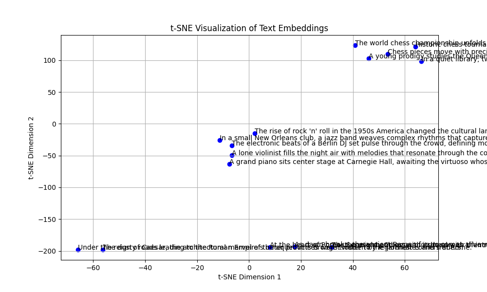

# Clustering Text Data with Pre-trained Language Models

## Methodology Overview

To examine topics related to J1 students on Reddit, we extracted embeddings from Reddit comments using models like BERT. These embeddings were then clustered using algorithms such as DBSCAN. We analyzed the different clusters to identify common themes. The final step involved using a large language model (LLM) to summarize the content of each cluster.

As an illustration, we use three categories: **Ancient Rome**, **Modern Video Games**, and **Chess**. These categories are selected because they have distinct and clear central themes, or "centroids," which makes them ideal for demonstrating the effectiveness of our clustering approach. 

```python
categories = {
    'Ancient Rome': [
        "As dawn breaks, the ancient Roman forum comes alive with the bustling sounds of merchants and "
        "philosophers.",
        "Under the reign of Caesar, the architectural marvel of the aqueducts brought water to the farthest "
        "corners of Rome.",
        "The Senate chamber, with its heavy air of intrigue and power, decided the fates of men and nations alike.",
        "At the heart of Rome, the mighty Colosseum echoed with the roars of lions and the cheers of the eager "
        "crowd.",
        "The dusty roads leading to the Roman Empire's outer provinces were trodden by legionnaires and traders."
    ],
    'Music': [
        "A lone violinist fills the night air with melodies that resonate through the cobblestone streets of "
        "Vienna.",
        "The rise of rock 'n' roll in the 1950s America changed the cultural landscape with its rebellious energy.",
        "In a small New Orleans club, a jazz band weaves complex rhythms that capture the essence of the city’s "
        "vibrant history.",
        "A grand piano sits center stage at Carnegie Hall, awaiting the virtuoso whose fingers bring life to "
        "Chopin’s nocturnes.",
        "The electronic beats of a Berlin DJ set pulse through the crowd, defining modern musical movements."
    ],
    'Chess': [
        "In a quiet library, two old friends silently battle over a chessboard, each move heavy with years of "
        "rivalry.",
        "The world chess championship unfolds in Moscow, with grandmasters from across the globe vying for "
        "supremacy.",
        "A young prodigy studies the Queen’s Gambit, dreaming of defeating seasoned players with her strategic "
        "prowess.",
        "Chess pieces move with precision across the board in a high-stakes game that draws a crowd at the park.",
        "Historic chess tournaments are revisited through aged books that recount the victories and defeats of "
        "chess legends."
    ]
}
```
## Generate Embeddings
Embeddings are numerical representations of text that capture the meaning and context of sentences in a high-dimensional space. Similar phrases will have embeddings that are close to each other in this space, while dissimilar ones will be farther apart. In this project, we use pre-trained language BERT (Bidirectional Encoder Representations from Transformers) to convert Redditor comments into embeddings. Models like BERT have been trained on a large corpus of text data and have learned to associate tokens with specific contexts and meanings. 

Below is an example of how embeddings are generated using the `bert-base-uncased` model from the 15 sentences above. Hence the 15 by 768 size. 

```python
for model in ['bert-base-uncased']:
    print(f"Model: {model}")
    embeddings = get_embeddings(sentences, model_name=model)
    print(embeddings)
    print(embeddings.shape)

# Output:
# Model: bert-base-uncased
# tensor([[ 0.0892,  0.1817,  0.0271,  ..., -0.1874,  0.1210,  0.0966],
#         [ 0.2929,  0.0323, -0.1956,  ..., -0.1411, -0.1362,  0.1235],
#         [ 0.3142,  0.2543,  0.3661,  ..., -0.0130, -0.0628,  0.0638],
#         ...,
#         [ 0.4064,  0.0932,  0.1824,  ..., -0.2790,  0.0708,  0.0557],
#         [-0.2299, -0.1457,  0.5706,  ..., -0.3244,  0.2410, -0.3141],
#         [ 0.3747,  0.0414,  0.3262,  ..., -0.1671, -0.1677, -0.2737]])
# torch.Size([15, 768])
```

## Cluster Embeddings
After generating embeddings from the text data, we apply the DBSCAN algorithm to cluster these embeddings into distinct groups. The idea is that similar sentences will have embeddings that are close together in the high-dimensional space, and each cluster ideally represents a common theme or topic present in the data, which we can then analyze to identify patterns within the text.

We use DBSCAN (Density-Based Spatial Clustering of Applications with Noise) for the clustering task because it can better handle the inherent complexities of language. We prefer DBSCAN over some popular algorithms such as Kmeans because it does not require the number of clusters to be predefined and can identify clusters of arbitrary shapes. In addition, DBSCAN is robust to noise and outliers, which are commonplace in textual datasets.

## Cluster Visualization
To gain insights into the structure and relationships within the clustered data, we use t-SNE (t-distributed Stochastic Neighbor Embedding) to visualize the high-dimensional embeddings in a two-dimensional space. One of the key reasons t-SNE is favored is its ability to preserve the local structure of data, meaning that it effectively maintains the relative distances between nearby points when reducing the data from high-dimensional space to lower dimensions. This makes it particularly effective for revealing clusters that might be hidden in higher dimensions. This visualization helps in understanding how well the clustering algorithm has grouped similar data points and whether the clusters correspond to meaningful themes in the text. 



## Summarize Clusters with Large Language Models
After clustering the text data, large language models (LLMs) are employed to summarize the content of each cluster. By leveraging the capabilities of models like GPT-4, we can generate concise and coherent summaries that capture the main themes or topics within each cluster. 

An illustration of how LLMs can be used to summarize the content of a cluster is shown below:

```python
import openai
text = clustered_df[clustered_df['cluster'] == 0]['text'].values
text = ' '.join(text)
prompt = f"The main theme across the below sentences is: {text}"

response = openai.Completion.create(
  engine="text-davinci-004",  # This is the identifier for GPT-4
  prompt=text,
  max_tokens=100
)
```
```
Output:
The main theme across these sentences is the depiction of daily life and key infrastructural and architectural achievements in ancient Rome, highlighting the city's vibrancy, technological advancements, and significant political and social activities.
```
